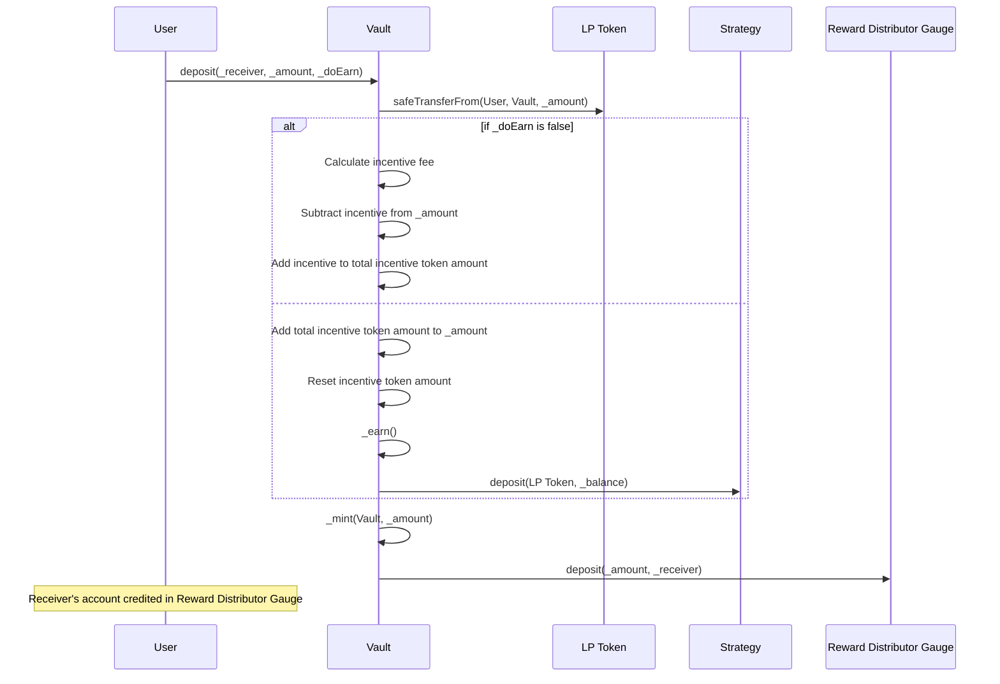
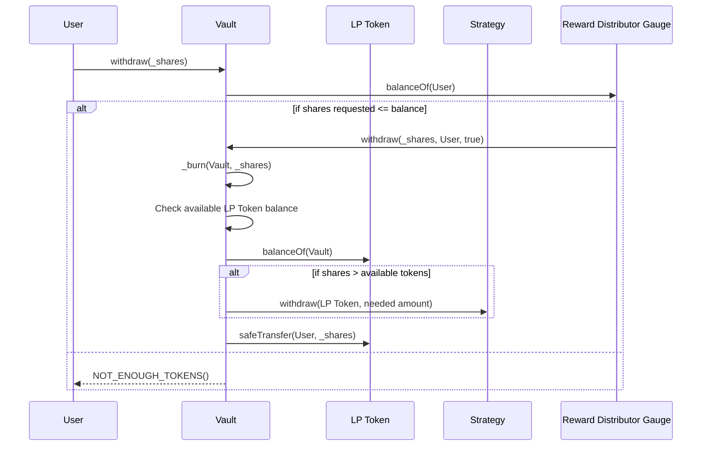
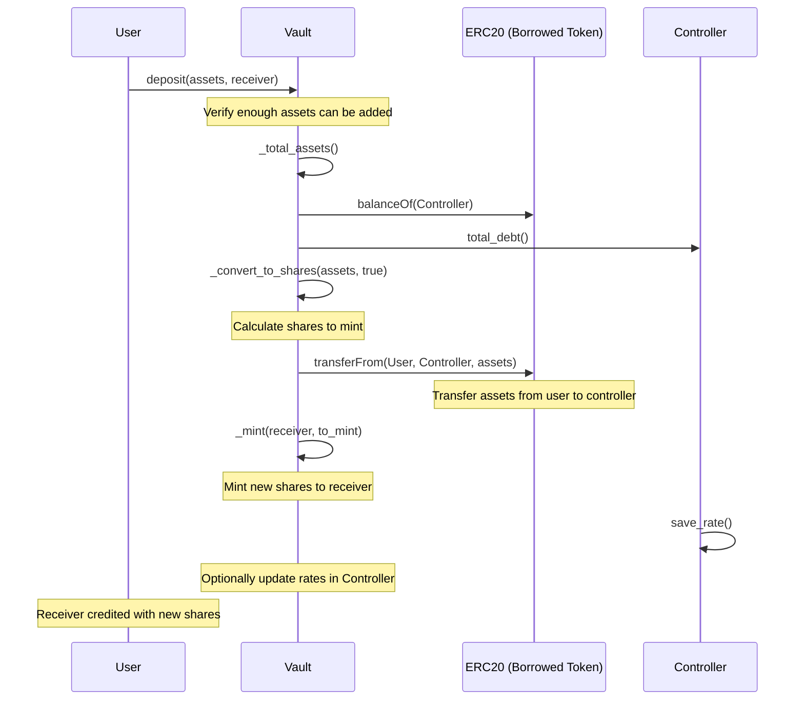
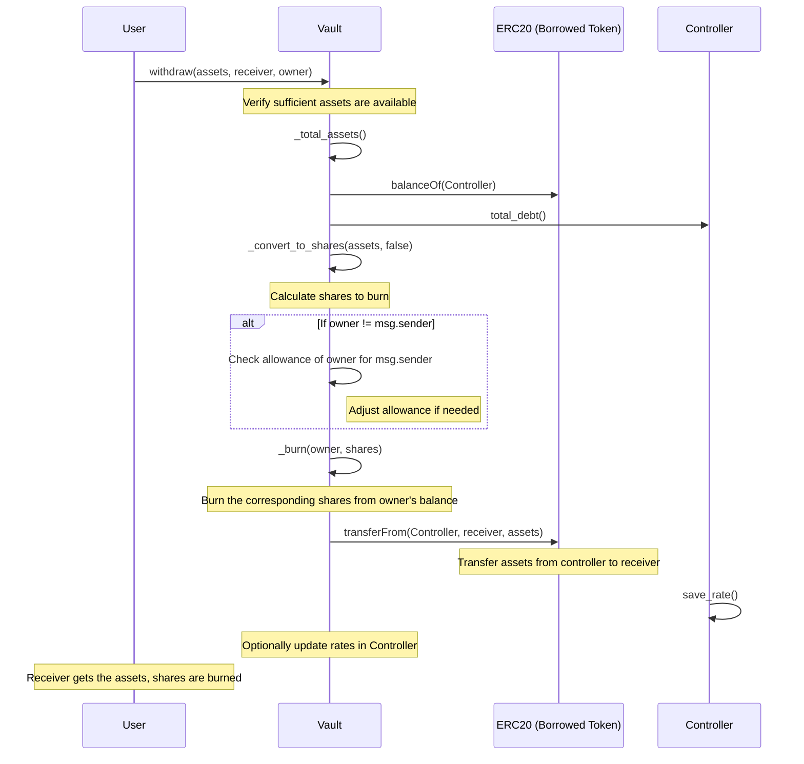

# Existing contract

## StakeDao deposit usecase

## StakeDao Withdraw usecase

## Curve Deposit usecase

## Curve Withdraw usecase

# Ressources

## Tools

- Abi to solidity interface code : https://bia.is/tools/abi2solidity/

## Contracts

## Stake DAO

https://www.stakedao.org/yield?chainId=1&protocol=llamalend

- Vault : https://etherscan.io/address/0xfa6D40573082D797CB3cC378c0837fB90eB043e5#code
- LP : https://etherscan.io/address/0xCeA18a8752bb7e7817F9AE7565328FE415C0f2cA#code
- Gauge (StakeDAO) : https://etherscan.io/address/0xFCc5a1B4e3d80Ce459e346A0b8F63b655ED709cb#code
- Gauge (Curve) : https://etherscan.io/address/0x49887dF6fE905663CDB46c616BfBfBB50e85a265
- ConvexFallBack : https://etherscan.io/address/0x360CE1C08Ab93e940275149655CA8419e97f8b4c#code

## Curve

https://lend.curve.fi/#/ethereum

- Vault : https://etherscan.io/address/0xcea18a8752bb7e7817f9ae7565328fe415c0f2ca#code
- Controller : https://etherscan.io/address/0xEdA215b7666936DEd834f76f3fBC6F323295110A#code
- AMM : https://etherscan.io/address/0xafca625321Df8D6A068bDD8F1585d489D2acF11b#code

- Gauge STAKE :

## Inner

- https://docs.google.com/spreadsheets/d/1NBay39-V_1s75x62JKiDrEd_1xAD6upsau8Zr8AgX0Q/edit?gid=2082479589#gid=2082479589

## Documentation

- https://Resources.curve.fi/lending/overview/

## Data

- https://dune.com/mrblock_tw/curve-llamalend
- https://defillama.com/protocol/curve-llamalend#information
- https://messari.io/project/curve-llamalend/protocols/curve-llamalend

## Erc-4626

- https://ethereum.org/fr/developers/docs/standards/tokens/erc-4626/
