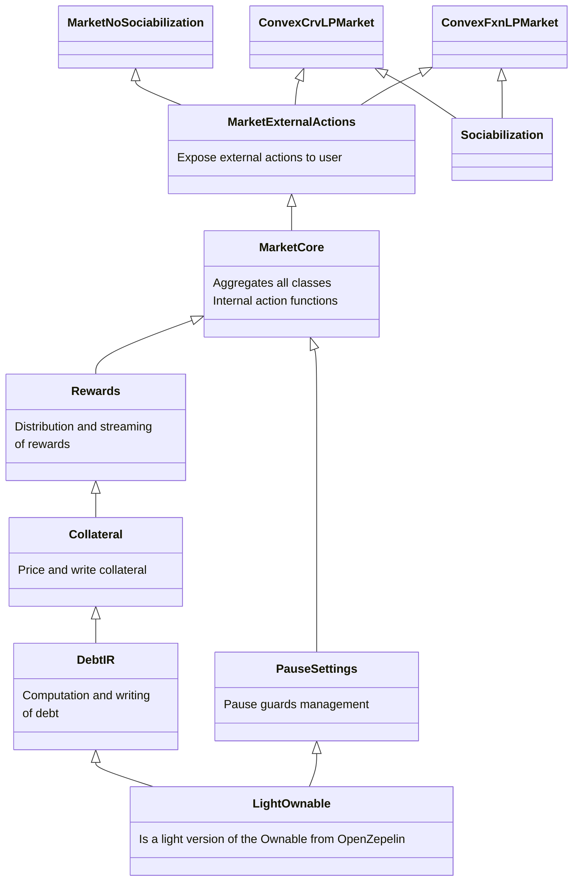

# Inheritance of a Market contract

```mermaid

classDiagram
DebtIR <|--LightOwnable
Collateral <|--DebtIR
MarketCore <|--PauseSettings
PauseSettings <|--LightOwnable
MarketCore <|--Rewards
Rewards <|--Collateral
MarketExternalActions <|--MarketCore

MarketNoSociabilization <|--MarketExternalActions
ConvexCrvLPMarket  <|--MarketExternalActions
ConvexFxnLPMarket <|--MarketExternalActions

ConvexCrvLPMarket  <|--Sociabilization
ConvexFxnLPMarket <|--Sociabilization

class LightOwnable{
    Is a light version of the Ownable from OpenZepelin
}
class PauseSettings{
    Pause guards management
}
class DebtIR{
    Computation and writing
    of debt
}
class Collateral{
    Price and write collateral
}
class Rewards{
    Distribution and streaming
    of rewards
}
class MarketCore{
    Aggregates all classes
    Internal action functions
}
class MarketExternalActions{
    Expose external actions to user
}
```
