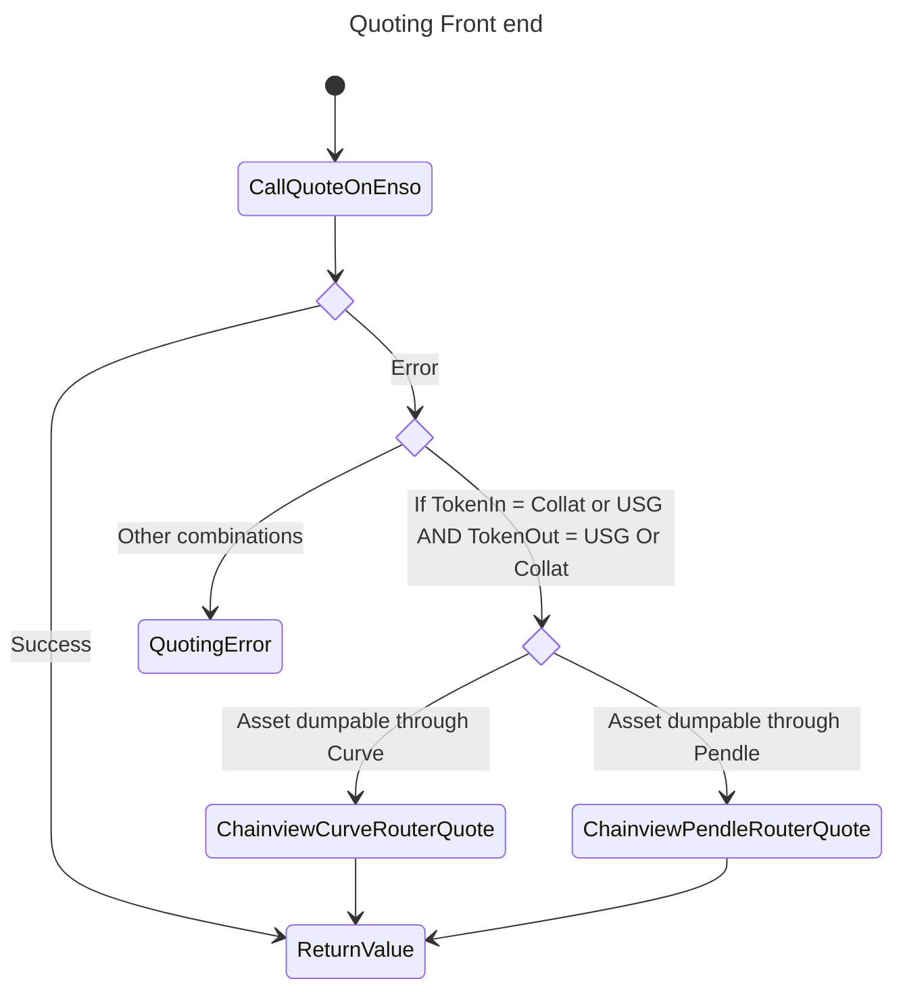

```mermaid
---
title: Quoting Front end
---

stateDiagram-v2
    state is_API_Up <<choice>>
    state is_secondary_routing_possible <<choice>>
    state secondary_routing_type <<choice>>

    [*] --> CallQuoteOnEnso
    CallQuoteOnEnso --> is_API_Up
    is_API_Up --> ReturnValue: Success
    is_API_Up --> is_secondary_routing_possible: Error
        is_secondary_routing_possible --> secondary_routing_type: If TokenIn = Collat or USG AND TokenOut = USG Or Collat
            secondary_routing_type--> ChainviewCurveRouterQuote : Asset dumpable through Curve
            secondary_routing_type--> ChainviewPendleRouterQuote : Asset dumpable through Pendle
            ChainviewCurveRouterQuote-->ReturnValue
            ChainviewPendleRouterQuote-->ReturnValue

        is_secondary_routing_possible --> QuotingError: Other combinations

```

```mermaid
---
title: Search ROUTE
---

stateDiagram-v2
    state is_API_Up <<choice>>
    state is_secondary_routing_possible <<choice>>
    state secondary_routing_type <<choice>>

    [*] --> CallRouteOnEnso
    CallRouteOnEnso --> is_API_Up
    is_API_Up --> ReturnValue: Success
    is_API_Up --> is_secondary_routing_possible: Error
        is_secondary_routing_possible --> secondary_routing_type: If TokenIn = Collat or USG AND TokenOut = USG Or Collat
            secondary_routing_type--> ChainviewCurveRouterQuote : Asset dumpable through Curve
            secondary_routing_type--> ChainviewPendleRouterQuote : Asset dumpable through Pendle
            ChainviewCurveRouterQuote-->ReturnValue
            ChainviewPendleRouterQuote-->ReturnValue

        is_secondary_routing_possible --> RoutingError: Other combinations

```
