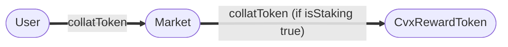
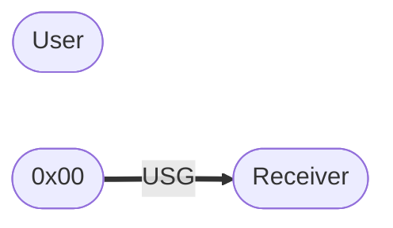
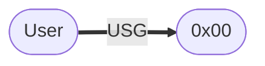
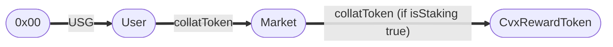
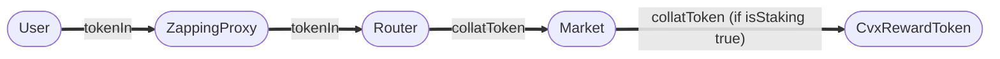
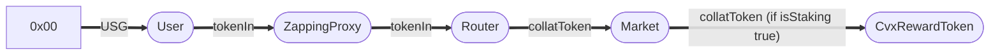

# ConvexCrv

## Deposit

```mermaid
flowchart LR
    user([User])
    market([Market])
    cvxRewardToken([CvxRewardToken])
    user == collatToken ==> market
    market == collatToken (if isStaking true) ==> cvxRewardToken
```

## Borrow

```mermaid
flowchart LR
    user([User])
    receiver([Receiver])
    0x00([0x00])
    0x00 == USG ==> receiver
```

## Repay

```mermaid
flowchart LR
    user([User])
    0x00([0x00])
    user == USG ==> 0x00
```

## Withdraw

```mermaid
flowchart LR
    user([User])
    0x00([0x00])
    user == USG ==> 0x00
```

## DepositAndBorrow

```mermaid
flowchart LR
    user([User])
    market([Market])
    cvxRewardToken([CvxRewardToken])
    0x00([0x00])
    user == collatToken ==> market
    market == collatToken (if isStaking true) ==> cvxRewardToken
    0x00 == USG ==> user
```

## ZapDeposit

```mermaid
flowchart LR
    user([User])
    market([Market])
    zappingProxy([ZappingProxy])
    router([Router])
    cvxRewardToken([CvxRewardToken])
    user == tokenIn ==> zappingProxy
    zappingProxy == tokenIn ==> router
    router == collatToken ==> market
    market == collatToken (if isStaking true) ==> cvxRewardToken
```

## ZapDepositAndBorrow

```mermaid
flowchart LR
    user([User])
    market([Market])
    zappingProxy([ZappingProxy])
    router([Router])
    cvxRewardToken([CvxRewardToken])
    user == tokenIn ==> zappingProxy
    zappingProxy == tokenIn ==> router
    router == collatToken ==> market
    market == collatToken (if isStaking true) ==> cvxRewardToken
    0x00 == USG ==> user

```
