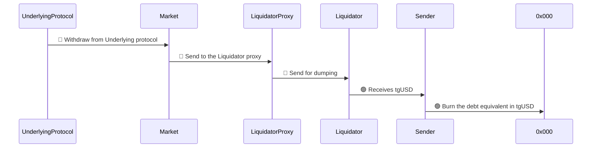
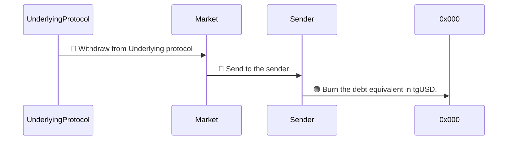

# Liquidations

A loan position is considered as liquidable when the health Ratio is inferior to 1.

When a position is liquidable, any account can call the **liquidate** function on the associated _market_ contract.

This function takes into parameters :

- **address** _account_ :
- **uint256** _tgUSDToRepay_ :
- **address** _liquidator_ :
- **bytes** _liquidationCall_ :

## Schemas

- 🔴 Collateral
- 🟢 tgUSD

### With liquidator

### Without liquidator

