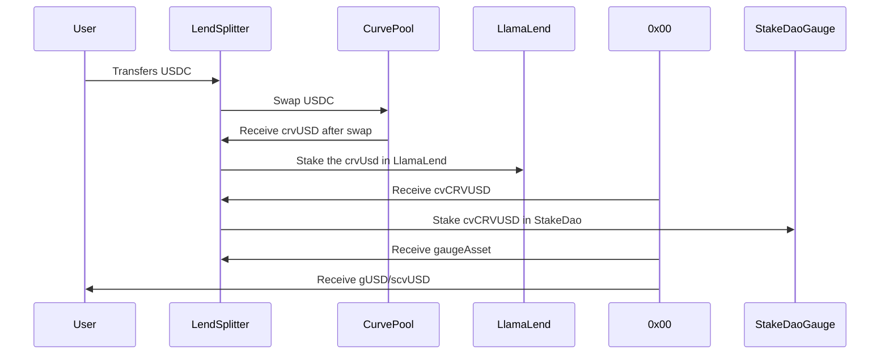
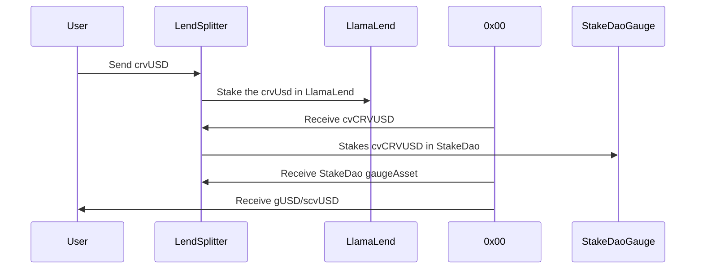
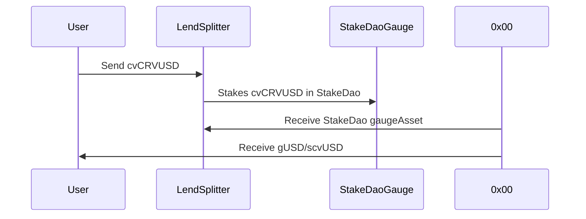
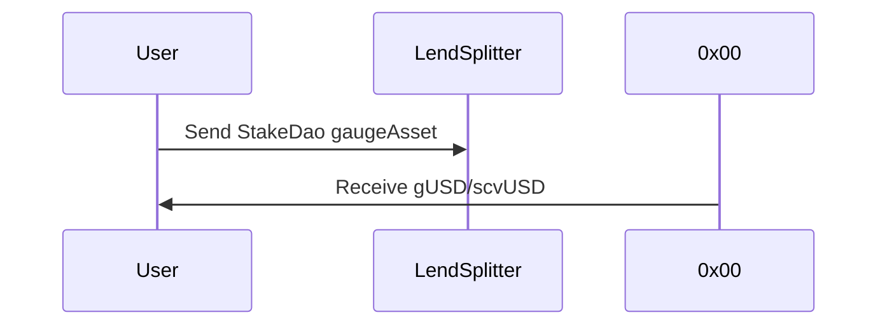
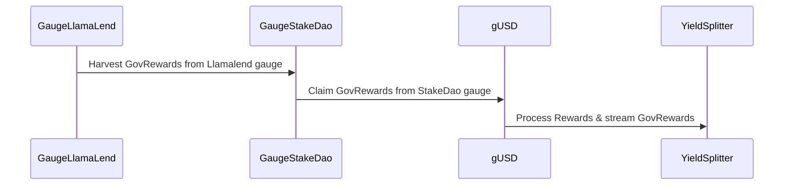
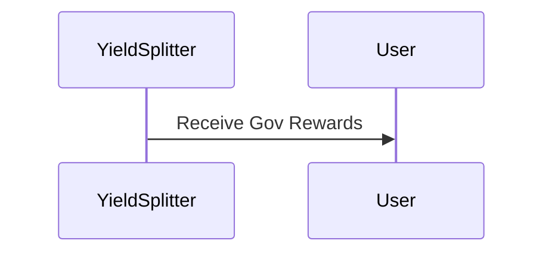

# ERC20 fluxes

## Deposit
### Deposit with stable not crvUSD

### Deposit with crvUSD

### Deposit with Llamalend deposit proof

### Deposit with StakeDao gauge asset

## Reward Processing

### Process Governance Rewards

## Claiming 

### Claim Governance Rewards

